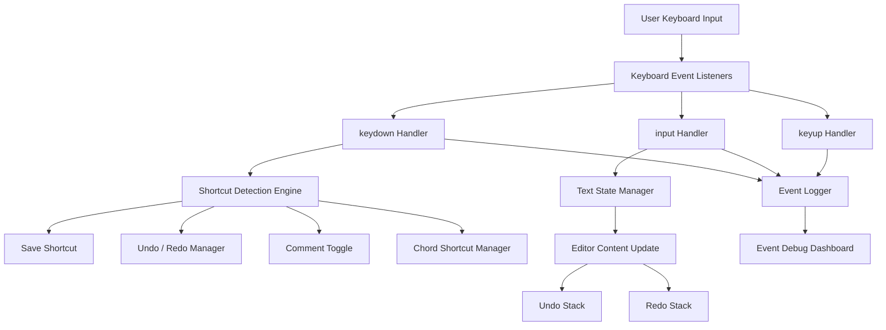
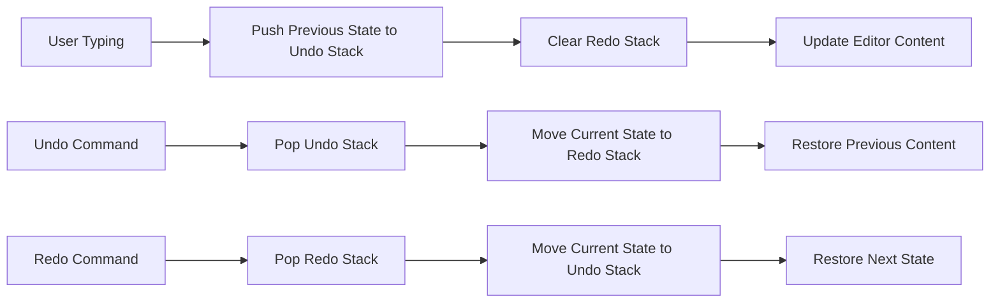
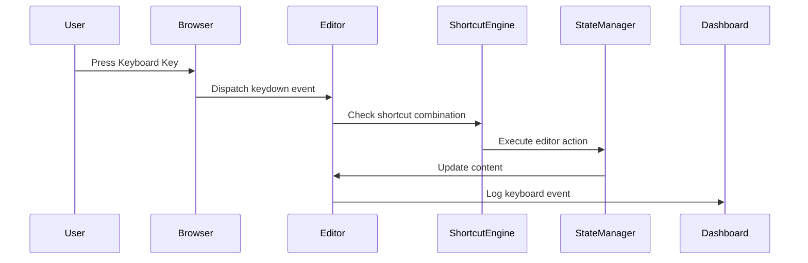
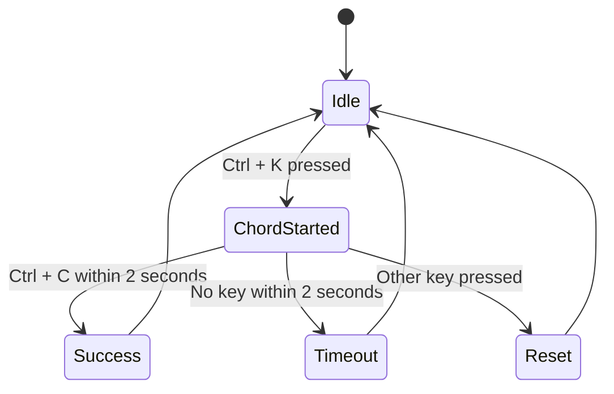
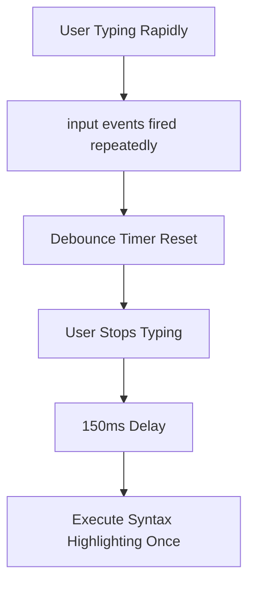
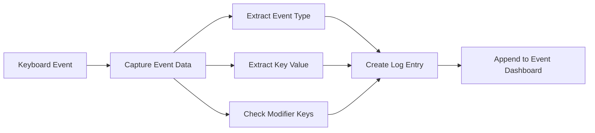
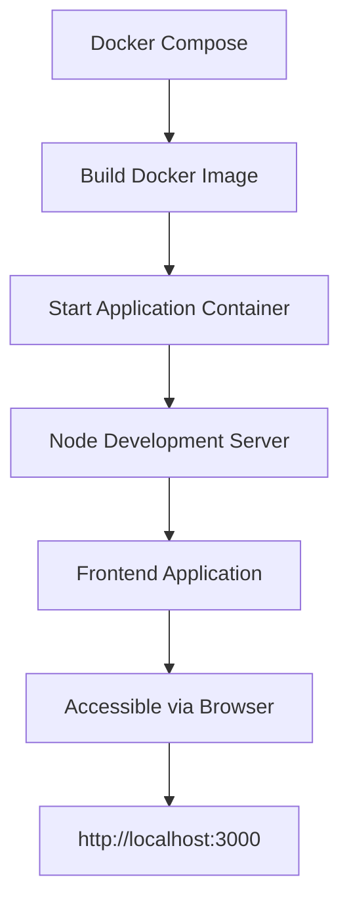

# Advanced Browser-Based Code Editor
### VS Code-Style Keyboard Handling with Event Debugging Dashboard

---

# Project Overview

This project implements a **browser-based code editor** designed to replicate the **keyboard-driven interaction model used in modern developer tools** such as Visual Studio Code, Google Docs, and Notion.

The editor focuses on **advanced keyboard event handling**, **state management**, and **performance optimization** techniques required for building responsive web-based productivity applications.

The system demonstrates how modern browsers handle:

- Complex keyboard shortcuts
- Cross-platform modifier keys
- Undo/Redo state history
- Input event processing
- Multi-step chord shortcuts
- Debounced operations
- Real-time event visualization

To ensure consistent development and evaluation environments, the entire application is **fully containerized using Docker and Docker Compose**.

---

# Key Capabilities

### Editor Capabilities

The editor provides several features that simulate behavior found in modern IDEs:

- Real-time text editing
- Line indentation using **Tab**
- Line outdent using **Shift + Tab**
- Automatic indentation on **Enter**
- Comment toggle using **Ctrl / Cmd + /**
- Multi-step chord shortcuts
- Undo / Redo history management
- Cross-platform shortcut compatibility

---

### Event Debugging Dashboard

A **real-time debugging dashboard** visualizes keyboard events fired by the browser.

The dashboard logs the following events:

- `keydown`
- `keyup`
- `input`
- `compositionstart`
- `compositionupdate`
- `compositionend`

Each event entry includes:

- Event Type
- Key Value
- Key Code
- Modifier Key Status

This dashboard helps developers understand **how browser keyboard events propagate and interact**.

---

# Application Interface Architecture

The application is divided into two major components:

```
+------------------------------------------------------------+
|                        Code Editor                         |
|                                                            |
|   User writes or edits code here                           |
|                                                            |
|                                                            |
+-------------------------------+----------------------------+
                                |
                                |
                                v
                   +--------------------------------+
                   |       Event Debug Dashboard    |
                   |                                |
                   | keydown : key = a              |
                   | keyup   : key = a              |
                   | input   : text inserted        |
                   | Action  : Save Triggered       |
                   +--------------------------------+
```

---

# System Architecture Diagram



---

# Editor State Management Architecture

The editor uses a **history stack model** to support Undo and Redo operations.



---

# Keyboard Shortcut Processing Pipeline



---

# Chord Shortcut State Machine

The editor supports **multi-step shortcuts** such as:

**Ctrl + K → Ctrl + C**



---

# Debounced Syntax Highlighting Flow

Syntax highlighting is simulated as a **computationally expensive operation**.

To avoid performance degradation during rapid typing, the highlight logic is **debounced**.



---

# Event Debugging Workflow



---

# Project Directory Structure

```
project-root
│
├── docker-compose.yml
├── Dockerfile
├── .env.example
├── package.json
├── README.md
│
└── src
   
```

---

# Supported Keyboard Shortcuts

| Shortcut | Action |
|--------|--------|
| Ctrl / Cmd + S | Trigger save action |
| Ctrl / Cmd + Z | Undo last change |
| Ctrl / Cmd + Shift + Z | Redo change |
| Ctrl / Cmd + / | Toggle line comment |
| Tab | Indent line |
| Shift + Tab | Outdent line |
| Enter | Create new line with same indentation |
| Ctrl + K then Ctrl + C | Execute chord shortcut |

---

# Global Verification Functions

To support automated evaluation, specific internal functions are exposed on the global window object.

### Editor State Inspection

```
window.getEditorState()
```

Returns:

```
{
  content: string,
  historySize: number
}
```

---

### Syntax Highlight Call Counter

```
window.getHighlightCallCount()
```

Used to verify **debounce behavior** during rapid typing.

---

# Docker Deployment Architecture



---

# Running the Application

### Clone Repository

```
git clone <repository-url>
cd browser-code-editor
```

### Start Docker Containers

```
docker-compose up --build
```

### Open in Browser

```
http://localhost:3000
```

---

# Environment Configuration

Example `.env.example`

```
APP_PORT=3000
NODE_ENV=development
```

This file documents required environment variables for the application.

---

# Accessibility (A11Y)

The editor includes accessibility support using ARIA attributes.

```
role="textbox"
aria-multiline="true"
```

This improves usability for:

- Screen readers
- Keyboard navigation
- Assistive technologies

---

# Technologies Used

- JavaScript
- React / Vanilla JavaScript
- HTML5
- CSS
- Docker
- Docker Compose

---

# Learning Outcomes

This project demonstrates implementation of:

- Advanced browser keyboard event handling
- Event-driven application architecture
- Undo / Redo history management
- Cross-platform keyboard shortcuts
- Multi-step chord command processing
- Debouncing for performance optimization
- Containerized frontend deployment

---

# Future Enhancements

Potential improvements include:

- Syntax highlighting engine
- Large file virtualization
- Real-time collaborative editing
- Plugin architecture
- Theme customization
- File system integration

---

# Conclusion

This project demonstrates how modern web applications handle **complex keyboard interactions**, **state management**, and **performance optimization**.

By combining event-driven design, state history management, and containerized deployment, the editor provides a scalable foundation for building **IDE-like browser applications and collaborative productivity tools**.

